# Guia de Utilização — Songhai

Este é um guia prático, com imagens, sobre como aceder e usar o site
principal, o Portal interno e o painel de gestão do blog. Não é um
documento técnico — para arquitetura, variáveis de ambiente e decisões
de infraestrutura, ver [DOCUMENTATION.md](../DOCUMENTATION.md).

## Índice

1. [Site principal](#1-site-principal)
2. [Aceder ao Portal](#2-aceder-ao-portal)
3. [O Hub do Portal](#3-o-hub-do-portal)
4. [Gestão de utilizadores](#4-gestão-de-utilizadores)
5. [Sistemas internos](#5-sistemas-internos)
6. [Dashboards de clientes](#6-dashboards-de-clientes)
7. [Métricas](#7-métricas)
8. [Painel do Blog](#8-painel-do-blog)
9. [Criar e editar artigos](#9-criar-e-editar-artigos)
10. [Blog público e RSS](#10-blog-público-e-rss)

---

## 1. Site principal

O site principal está em **https://songhai.cc**. É a página pública da
empresa — serviços, setores, método de trabalho, FAQ, formulário de
contacto e blog.

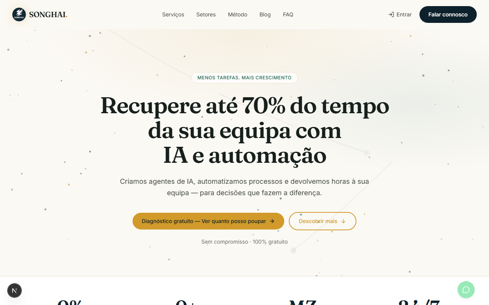

O botão **"Falar connosco"**, no cabeçalho, leva sempre diretamente à
página de contacto (`/contacto`), onde o formulário envia um e-mail
real para a equipa.

---

## 2. Aceder ao Portal

O Portal interno está em **https://portal.songhai.cc** e é de uso
exclusivo da equipa Songhai (só e-mails `@songhai.cc`).

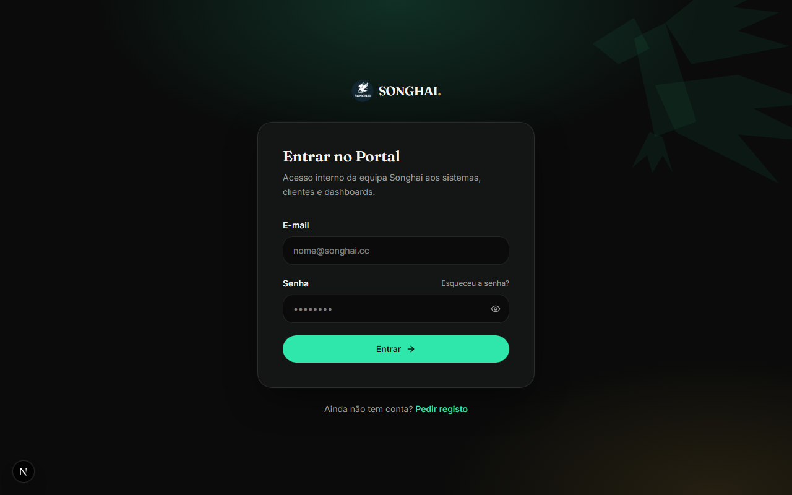

- Quem já tem conta introduz o e-mail e a senha e clica **Entrar**.
- Quem ainda não tem conta clica em **"Pedir registo"**, que leva ao
  formulário de registo:

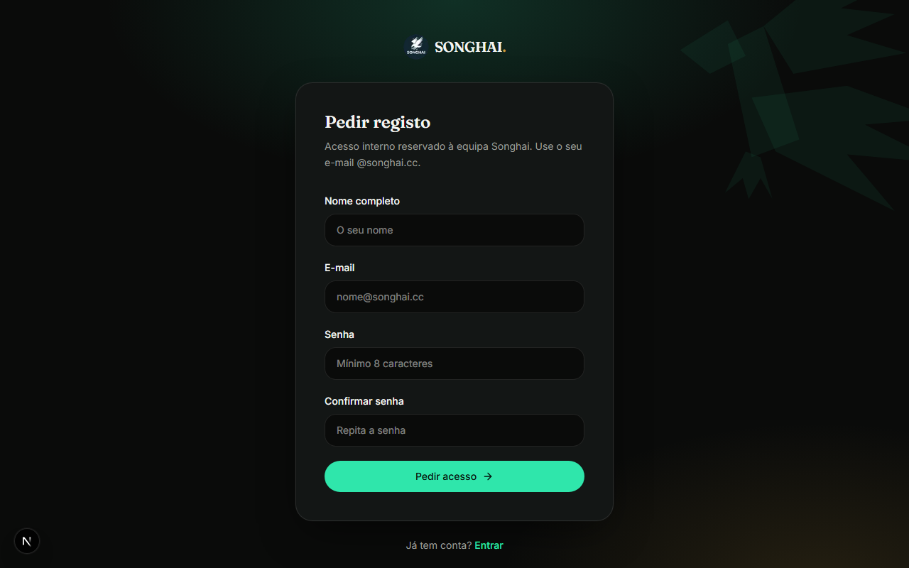

Depois de submeter o registo, a conta fica **pendente** até um
administrador a aprovar (ver secção [4](#4-gestão-de-utilizadores)).
A primeira conta a ser registada no sistema torna-se automaticamente
administradora.

Se esquecer a senha, o link **"Esqueceu a senha?"** no ecrã de login
envia um e-mail com um link de reposição.

> Nota: a autenticação em dois fatores (2FA) está preparada no sistema
> mas encontra-se temporariamente desativada — deverá ser configurada
> numa fase posterior.

---

## 3. O Hub do Portal

Depois de entrar, o Portal mostra um painel central ("Para onde quer
ir?") com um cartão para cada área — os cartões visíveis dependem das
permissões de cada utilizador.

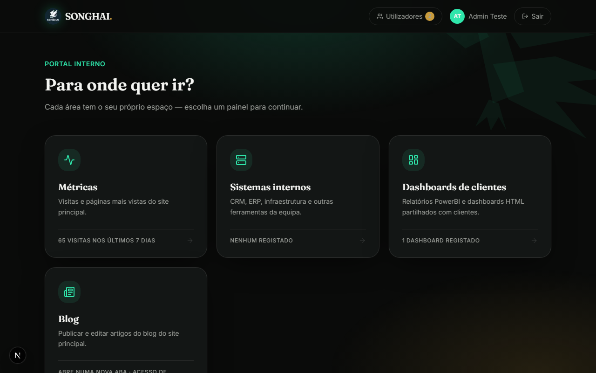

Áreas disponíveis:

- **Utilizadores** *(só administradores)* — aprovar registos, atribuir
  papéis e permissões.
- **Métricas** — visitas e páginas mais vistas do site principal.
- **Sistemas internos** — CRM, ERP, e outras ferramentas da equipa.
- **Dashboards de clientes** — relatórios PowerBI e dashboards HTML
  partilhados com clientes.
- **Blog** — abre o painel de gestão de artigos do site principal
  (numa nova aba, com sessão própria — ver secção
  [8](#8-painel-do-blog)).

---

## 4. Gestão de utilizadores

Acessível apenas a administradores, através do cartão **Utilizadores**
no hub, ou do atalho no cabeçalho.

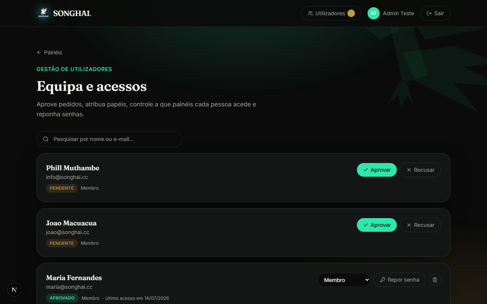

Nesta página é possível:

- **Pesquisar** por nome ou e-mail.
- **Aprovar** ou **recusar** pedidos de registo pendentes.
- Alterar o **papel** de um utilizador aprovado (Membro / Admin) através
  do menu suspenso.
- **Repor a senha** de um utilizador (gera uma nova senha temporária).
- **Apagar** uma conta.
- Controlar, por utilizador, **a que painéis específicos** tem acesso
  (por exemplo, dar acesso só a Dashboards sem dar acesso a Sistemas
  internos).

Por segurança, o sistema não permite remover o estatuto de
administrador do último administrador restante, nem apagar a própria
conta enquanto sessão ativa.

---

## 5. Sistemas internos

Lista de ferramentas de uso interno da equipa (CRM, ERP, infraestrutura,
etc.), geridas por quem tem permissão de administração de sistemas.

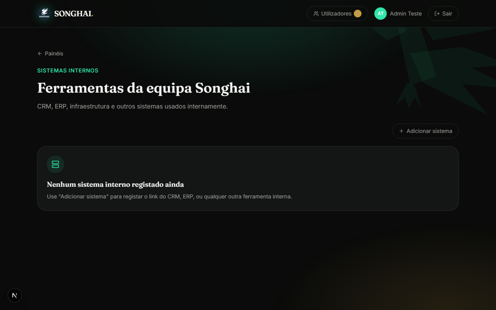

Cada sistema pode ser aberto diretamente dentro do Portal, com a mesma
funcionalidade de visualização (maximizar / abrir numa aba
independente) descrita a seguir para os dashboards.

---

## 6. Dashboards de clientes

Aqui ficam os relatórios (links do PowerBI, ou ficheiros HTML) que a
equipa partilha com clientes.

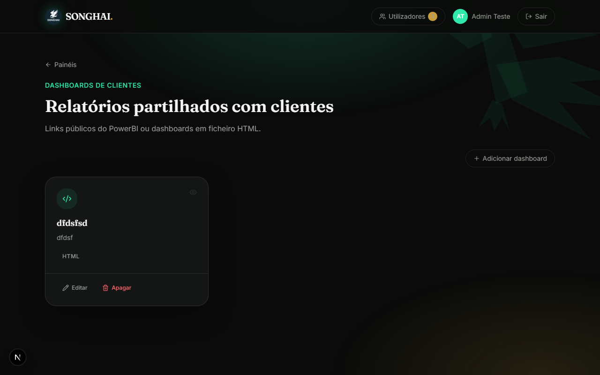

Ao clicar num dashboard, este abre **dentro do próprio Portal**, num
visualizador embutido (iframe) — não é preciso sair do site para ver o
conteúdo. Nesse visualizador há duas opções extra:

- **Maximizar** — expande o dashboard para ecrã inteiro, mantendo
  sempre visível um botão para minimizar e voltar ao tamanho normal.
- **Abrir numa aba independente** — abre o link original numa nova
  aba do navegador, fora do Portal.

Administradores e utilizadores com permissão podem **adicionar**,
**editar** ou **apagar** dashboards através do botão "Adicionar
dashboard".

---

## 7. Métricas

Mostra as visitas e páginas mais vistas do site principal (songhai.cc),
recolhidas automaticamente à medida que os visitantes navegam no site.

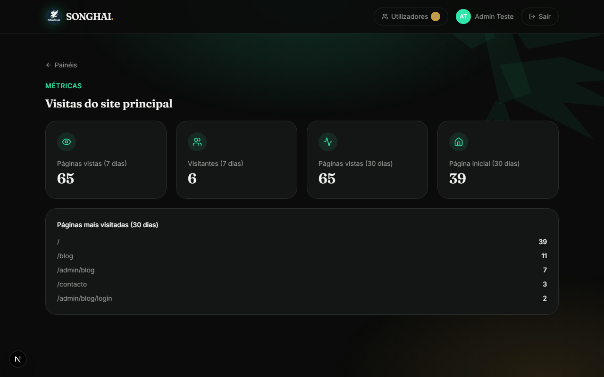

Os números refletem sempre os últimos dias de tráfego real do site —
não é preciso nenhuma configuração adicional para os ver.

---

## 8. Painel do Blog

O painel de gestão do blog não vive no Portal — vive no site principal
(`songhai.cc/admin/blog`) — mas só é acessível **a partir do Portal**,
clicando no cartão **Blog**. Isto garante que só administradores do
Portal conseguem publicar no blog, sem precisar de uma segunda conta
ou senha separada: o Portal gera um link de acesso temporário e
válido uma única vez, que abre o painel do blog já autenticado.

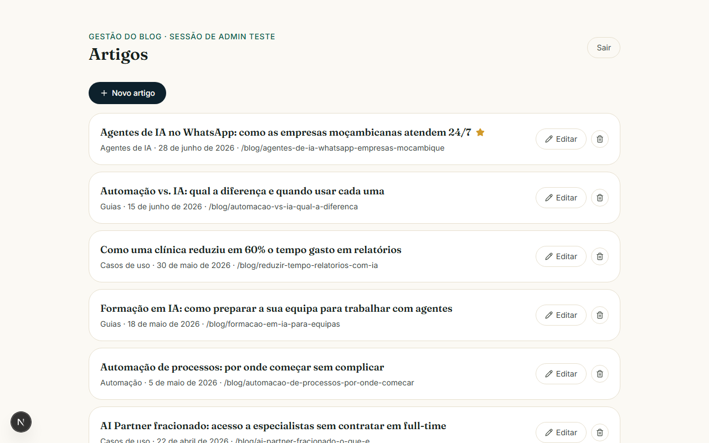

A lista mostra todos os artigos, incluindo:

- **Publicados** — visíveis publicamente no blog.
- **Rascunho** — só visíveis neste painel.
- **Agendado** — já marcados como "publicado", mas com uma data de
  publicação no futuro; ficam automaticamente visíveis ao público
  assim que essa data/hora chegar, sem necessidade de qualquer ação
  manual.

---

## 9. Criar e editar artigos

Ao clicar em **"Novo artigo"** (ou em **Editar** num artigo existente),
abre-se o formulário completo do editor:

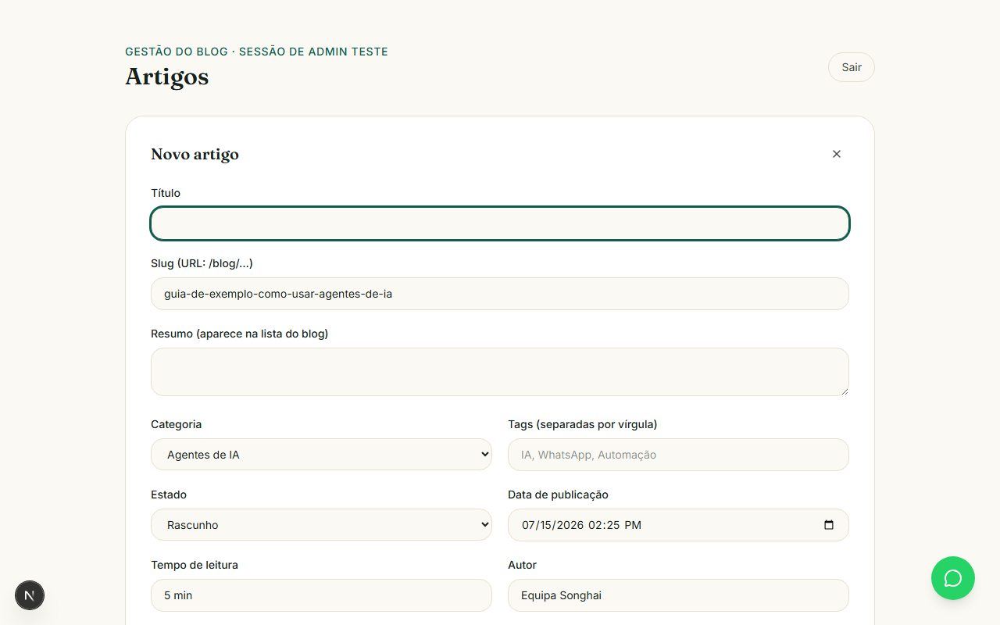

Campos principais:

- **Título** e **Slug** (o slug gera-se automaticamente a partir do
  título, mas pode ser editado à mão — é o que aparece no endereço do
  artigo, ex.: `songhai.cc/blog/o-meu-slug`).
- **Resumo** — texto curto mostrado na listagem do blog.
- **Categoria** e **Tags** (separadas por vírgula) — as tags aparecem
  como filtros clicáveis no blog público.
- **Estado** — Rascunho ou Publicado.
- **Data de publicação** — permite agendar um artigo para o futuro.
- **Imagem de capa** — upload de imagem, usada na listagem, no topo do
  artigo e nas redes sociais (Open Graph).
- **Conteúdo** — cada secção do artigo usa um **editor de texto rico**
  (negrito, itálico, títulos, listas, links e imagens inseridas
  diretamente no texto), em vez de texto simples.

Depois de guardado, o artigo aparece na lista com uma etiqueta de
estado ("Rascunho" / "Agendado" / publicado) para facilitar a gestão.

---

## 10. Blog público e RSS

O resultado final fica visível para qualquer visitante em
**songhai.cc/blog**:

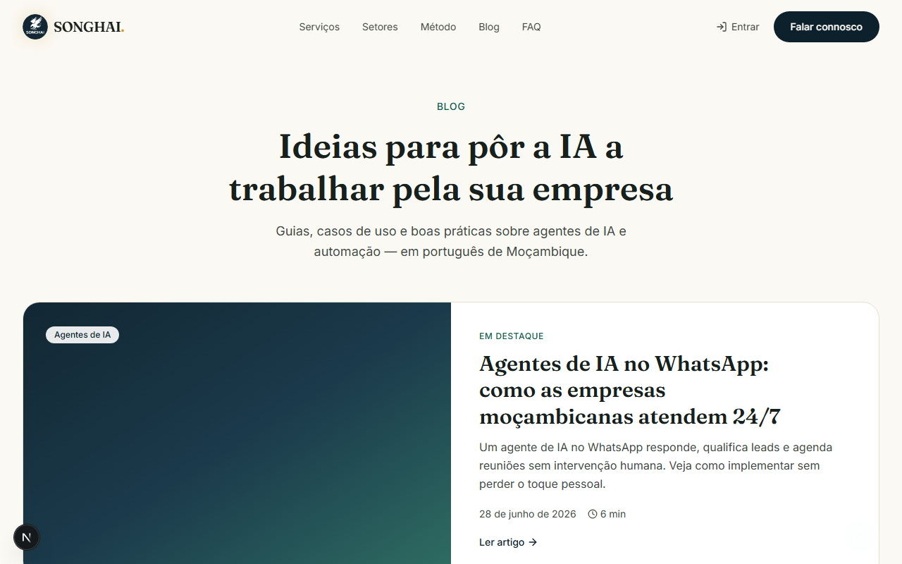

E cada artigo tem a sua própria página, com imagem de capa, tags
clicáveis (que filtram o blog por essa tag) e tempo de leitura:

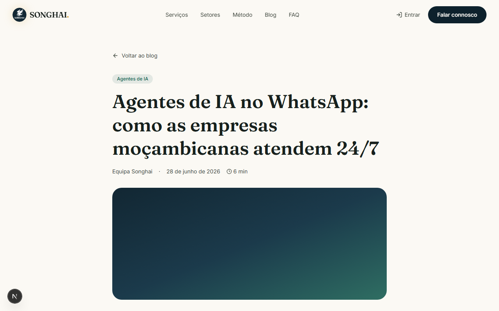

O blog também disponibiliza um **feed RSS** em
**songhai.cc/feed.xml**, com todos os artigos publicados, para quem
preferir seguir novidades por leitor de feeds.
